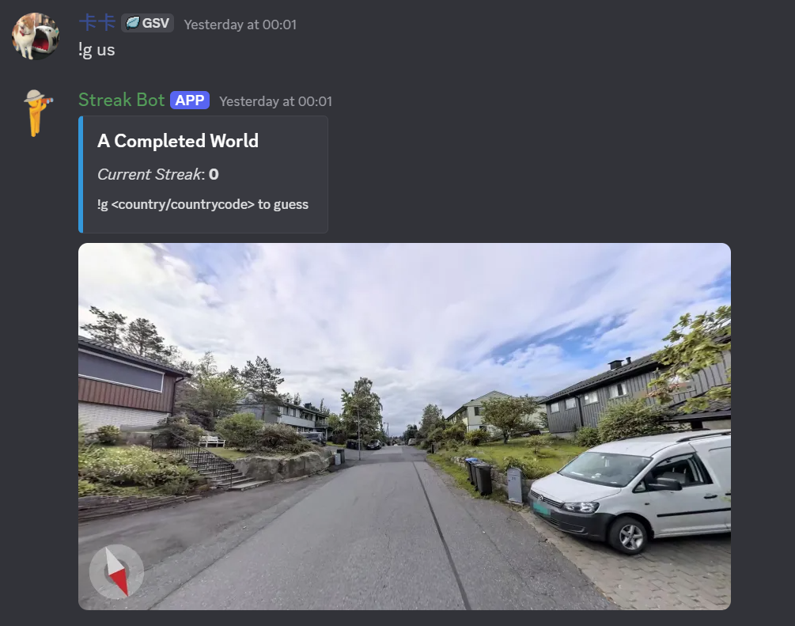

# GeoGuessr Streakbot

A Discord bot for playing GeoGuessr streaks with friends. Players are shown Street View images and must guess the correct subdivision (region) to maintain their streak. The bot supports multiple street view providers (Google, Bing, Apple, Baidu, Tencent, Yandex, Kakao, OpenMap) and can be configured for different countries or regions.



## Features

- Solo and assisted streaks
- Accuracy tracking and detailed player statistics
- Personal and global leaderboards
- Compass overlay and direction hints
- 5K (perfect score) tracking
- Map switching and custom map support
- Support for multiple Street View providers (Google, Bing, Apple, Baidu, Tencent, Yandex, Kakao, OpenMap)
- Flexible region/country aliasing

---

## Setup

1. **Clone the repository**
2. **Install dependencies:**
    ```
    pip install -r requirements.txt
    ```
3. **Set up environment variables:**
    - `DISCORD_TOKEN` - Your Discord bot token
    - `NCFA` - GeoGuessr authentication cookie
    - `BIGDATACLOUD_API_KEY` - API key for reverse geocoding

4. **Configure allowed channels in `config.py`**
5. **Run the bot:**
    ```
    python bot.py
    ```

---

## Configuring Maps

- The bot is pre-configured for several maps and subdivision aliases.
- To play in other countries (for State Streak) and worldwide map(for Country Streak), update the aliases in `regions.py` and the maps settings in `config.py`.
---

## Supported Commands

### Game Commands

- `!guess [subdivision]`  
  Make a guess for the current round.

- `!pic`  
  Show the current round's picture again.

- `!compass`  
  Show the compass direction for the current round.

- `!skip`  
  Skip the current round (resets streak).

- `!map`  
  Get a link to the ChatGuessr map.

### Stats & Leaderboards

- `!stats`  
  Show your personal statistics.

- `!stats subdivisions`  
  Show your personal subdivisions statistics.

- `!stats global`  
  Show global statistics.

- `!leaderboard`  
  Show top streaks.

- `!5k`  
  Show your 5K (perfect score) statistics.

### Utility

- `!aliases [subdivision]`  
  Show all aliases for a given subdivision.

- `!participants`  
  Show all participants in the current streak.

- `!switchmap`  
  Switch between available maps.

### Moderation

- `!start`  
  Manually start a new game (resets streak).

- `!fix`  
  If something breaks, manually start a new game (doesn't reset streak).

---

## Advanced Configuration

- **Adding new map providers:**  
  Extend the map provider logic in `models.py` to support new sources.
- **Customizing region/country aliases:**  
  Edit `regions.py` to add or modify aliases for subdivisions or countries.

---

## Contribution

Pull requests and suggestions are welcome! Please open an issue for major changes or feature requests.

---

## License

BSD 3-Clause License
